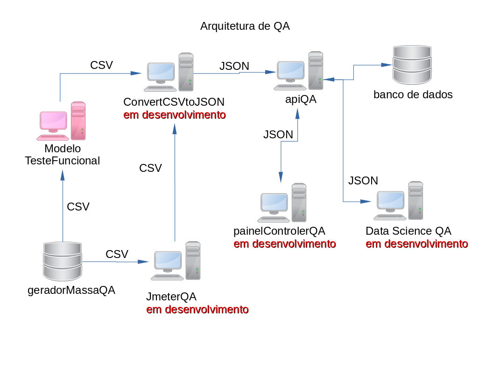

# ModeloTesteFuncional

> ModeloTeste, faz parte de arquitetura de sistema para testa sistemas web.  
> Versão 04 / atualizado 25/Jun/2020

> ** Ferramentas de desenvolvimento **  
> * Java - versão 8
> * Junit
> * Selenium (Webdriver)
> * Sonarqube
> * OpenCSV  

# Mode de execucão.

>	Para executar o teste use a classe ExecutaTeste da pasta config. 

> 	Os testes podem ser executados ou no Cucumber ou no Junit.  
> 	Na pasta config, temos 2 classes que são :

> __RunnerTestCucumber__  

> 	Os teste serão executados na forma tradicional da execucão do Cucumber.
> 	Colocando o caminho da pasta steps do seu projeto.
	
> ** RunnerTestJunit **  

> 	Os testes serão executados pelo Junit, colocando no nome da classe.
> 	No caso desse projeto o nome e TC_001_PaginaPrincipal.class, que fica no pacote cenarioTeste.

> __Alterar o modo de execucao__  

> 	No raiz do projeto, tem uma arquivo chamado config.properties. Nele o usuario pode altera o modo
> 	para RunnerTestJunit ou RunnerTestCucumber

# Evidência de teste.

> 	Sera criado na raiz do projeto a pasta FERRAMENTA_TESTE, onde sera criar uma arquivo CSV 
> 	no termino da execução do teste.
> 	No diretório é gerado arquivo no formato CSV com o resultados dos steps do teste.
> 	Exemplo :

> 	Status,Data,Hora,Nome Metodo, Mensagem Erro
> 	OK,23-02-2020,01:32,setTxtPesquisar  

> 	Nesse exemplo a coluna Mensagem ERRO está vazia, porquê, não deu erro na execução do teste.
> 	Caso tenha dado errado, será preenchido com uma mensagem.
> 	Exemplo : 

> 	Status,Data,Hora,Nome Metodo, Mensagem Erro
> 	ERRO,23-02-2020,01:32,cenarioTestePesquisarComTexto,Tried to run command without establishing a connection.

# Linha de comandos.

> __Sonarqube__  

> 	mvn sonar:sonar -Dsonar.host.url=http://localhost:9000
> 	ou
> 	mvn clean verify sonar:sonar

# Como executar os teste.

> 	Na raiz do projeto, o arquivo config.properties, tem as configurações para a execução do teste.

# Links dos projetos da arquitetura.
> __Modelo Teste Funcional__
> [GitHub Pages](https://github.com/marcosregato/modeloTesteFuncional). 

> __Painel Teste Angular__
> [GitHub Pages](https://github.com/marcosregato/painelTesteAngular). 

> __Api Teste MongoDB__
> [GitHub Pages](https://github.com/marcosregato/apiTesteMongoDB). 

> __convert CSV to JSON__
> [GitHub Pages](https://github.com/marcosregato/convertCSVtoJSON). 

> __Data Science QA__
> [GitHub Pages](https://github.com/marcosregato/dataScienceQA). 

> __Teste Api QA__
> [GitHub Pages](https://github.com/marcosregato/testeApiQA). 

> __Gerador massa de dados QA__
> [GitHub Pages](https://github.com/marcosregato/geradorMassaQA). 

